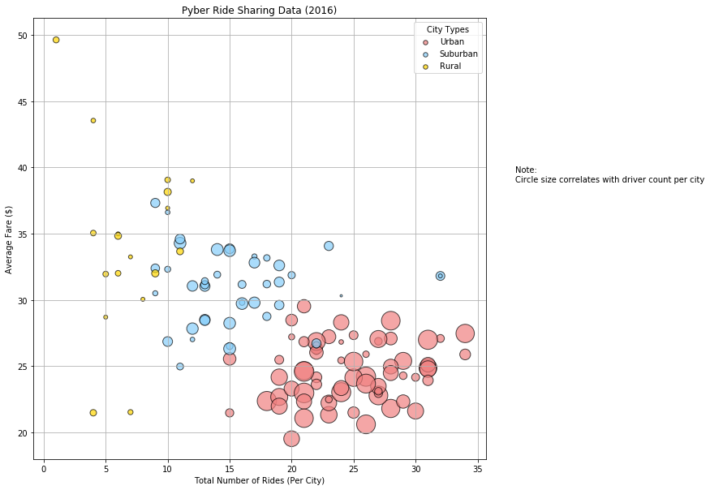

# Pyber Ride Sharing

# Analysis

86% of total drivers are from urban areas, however they contribute to 62% of total fares. This be the reason why fares are much lower in urban areas since there is a high number of supply and the demand may not be as high.

13% of total drivers are from suburban areas, however they contribute to 31.4% of total fares. This may be because they are using ride sharing from urban areas into suburban areas therefore having a longer distance and higher fare.

1% of total drivers are from rural areas, however they contribute to 6.6% of total fares. Again unable to conclude direct cause but this may be because rural ride share users are traveling longer distances. Another reason could be the low supply and ride sharing app alogrithims that price according to demand.


```python
#import dependencies
import matplotlib.pyplot as plt
import numpy as np
import pandas as pd
import seaborn as sns
import scipy as sp

#file path
city_file = 'raw_data/city_data.csv'
ride_file = 'raw_data/ride_data.csv'

#read csv into dataframe
city_df = pd.read_csv(city_file)
ride_df = pd.read_csv(ride_file)

#group by city to calculate city level data
ride_by_city = ride_df.groupby(ride_df['city'])

#to merge avg_fare_city with city_df we needed to reset 
#the index to have a column named city to merge on
avg_fare_city = ride_by_city.mean().reset_index()
rides_count = ride_by_city.count().reset_index()


#merge grouped city data with city df
super_city = pd.merge(city_df, avg_fare_city, on = 'city', how = 'outer')
#renaming before second merge
clean_super_city = super_city.rename(columns={"fare": "avg_fare"})

clean_super_city = clean_super_city[['city', 'avg_fare', 'driver_count','type']]

#merge with count of unique ride ids
super_city2 = pd.merge(clean_super_city, rides_count,on = 'city', how = 'outer')

super_city2 = super_city2.rename(columns={"ride_id": "ride_count"})

clean_super_city2 = super_city2[['city', 'avg_fare', 'driver_count','type','ride_count']]

#spliting out urban, suburban and rural data to plot as different colors
super_city_urban = clean_super_city2.loc[clean_super_city2['type'] == 'Urban']
super_city_suburban = clean_super_city2.loc[clean_super_city2['type'] == 'Suburban']
super_city_rural = clean_super_city2.loc[clean_super_city2['type'] == 'Rural']
```

# Bubble Plot of Ride Sharing Data


```python
#could not plot using plt.scatter had to use fig = plt.figure to plot multiple subplots
fig = plt.figure(figsize=(10,10))
urban_plot = fig.add_subplot(111)
suburban_plot = fig.add_subplot(111)
rural_plot = fig.add_subplot(111)

# use the scatter function setting driver count as circle size*8
urban_plot.scatter(super_city_urban['ride_count'],super_city_urban['avg_fare'], 
                        (super_city_urban['driver_count']*8),facecolors='lightcoral', edgecolors='black', alpha=0.7,
                        label='Urban')
suburban_plot.scatter(super_city_suburban['ride_count'],super_city_suburban['avg_fare'], 
                        (super_city_suburban['driver_count']*8),facecolors='lightskyblue', edgecolors='black', alpha=0.7,
                        label='Suburban')
rural_plot.scatter(super_city_rural['ride_count'],super_city_rural['avg_fare'], 
                        (super_city_rural['driver_count']*8),facecolors='gold', edgecolors='black', alpha=0.7,
                        label='Rural')


#set apperance
textstr = 'Note:\nCircle size correlates with driver count per city'
plt.xlabel('Total Number of Rides (Per City)')
plt.ylabel('Average Fare ($)')
plt.title('Pyber Ride Sharing Data (2016)')
plt.figtext(.95, .60, textstr)
plt.grid(True)
lgnd = plt.legend(loc='best', title = 'City Types')

#legend circles were sizing differently this made them even at the size we set
for handle in lgnd.legendHandles:
    handle.set_sizes([30.0])

plt.show()
```

    /anaconda3/lib/python3.6/site-packages/matplotlib/cbook/deprecation.py:106: MatplotlibDeprecationWarning: Adding an axes using the same arguments as a previous axes currently reuses the earlier instance.  In a future version, a new instance will always be created and returned.  Meanwhile, this warning can be suppressed, and the future behavior ensured, by passing a unique label to each axes instance.
      warnings.warn(message, mplDeprecation, stacklevel=1)





# Total Fares By City Type 


```python
#pyber default colors
colors = ['gold', 'lightskyblue', 'lightcoral']

#we only need fare and city type for this chart
city_fare = ride_df[['city', 'fare']]

#m
merge_city_fare = pd.merge(city_df, city_fare, on='city', how='left')

#group data set by city type and sum driver_count and fare columns to get pie chart data
total_fare_city_type = merge_city_fare.groupby(merge_city_fare['type']).sum().reset_index()

#list of city types
labels = total_fare_city_type['type']

#for this pie chart, we are going to use total fares as our pie slice
area_total_fares = total_fare_city_type['fare']


#plot piechart autopct to display the percent value using Python string formatting
plt.pie(area_total_fares, explode=explode, labels=labels, colors=colors,
        autopct="%1.1f%%", shadow=True, startangle=140)

#appearance
explode = (0, 0, 0.1)
plt.title('% of Total Fares by City Type')
plt.axis('equal')

#display the chart
plt.show()
```


# Total Rides by City Type


```python
#pyber default colors
colors = ['gold', 'lightskyblue', 'lightcoral']

#we only total rides per city and city type for this chart
total_rides = rides_count[['city', 'ride_id']].copy()
city_types = city_df[['city','type']]
merge_city_ride = pd.merge(total_rides, city_types, on='city', how='right')
merge_city_ride = merge_city_ride.rename(columns = {"ride_id": "ride_count"})

#group data set by city type and sum ride count
rides_by_city_type = merge_city_ride.groupby(merge_city_ride['type']).sum().reset_index()
rides_by_city_type

#list of city types labels2 used labels for previous plot
labels2 = rides_by_city_type['type']

#data for pie chart
total_rides = rides_by_city_type['ride_count']

#plot pie chart
plt.pie(total_rides, explode=explode, labels=labels2, colors=colors,
        autopct="%1.1f%%", shadow=True, startangle=140)

#pie chart appearance
explode = (0, 0, 0.1)
plt.title('% of Total Rides by City Type')
plt.axis('equal')

#display the chart
plt.show()
```


# Total Drivers by City Type


```python
total_drivers = total_fare_city_type['driver_count']

explode = (0, 0, 0.1)

#plot pie chart
plt.pie(total_drivers, explode=explode, labels=labels, colors=colors,
        autopct="%1.1f%%", shadow=True, startangle=140)

#appearance
plt.title('% of Total Drivers by City Type')
plt.axis('equal')


plt.show()
```


